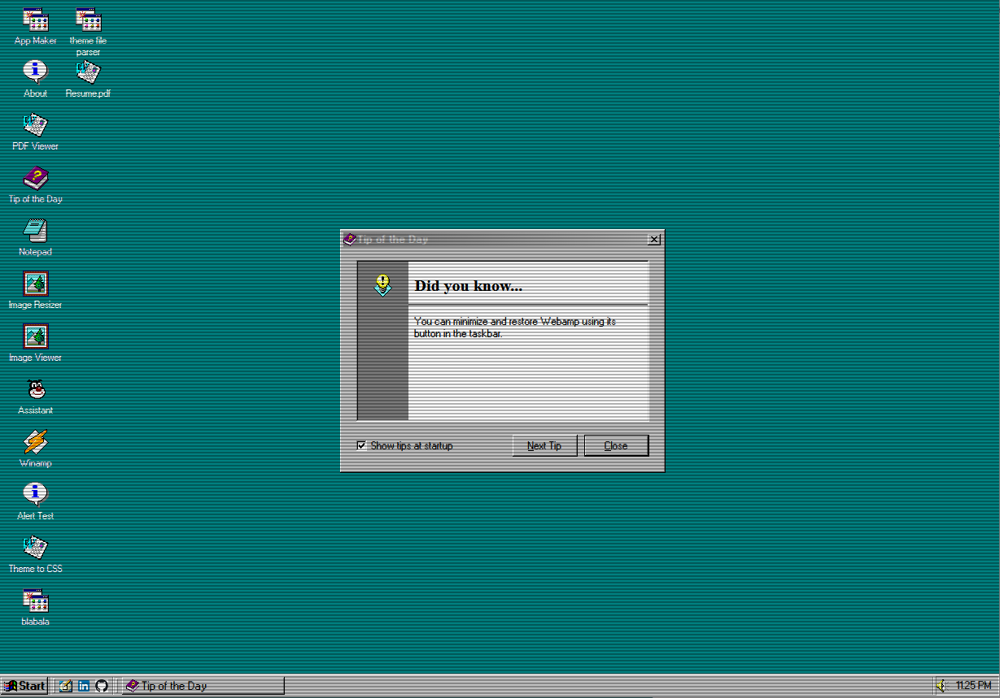
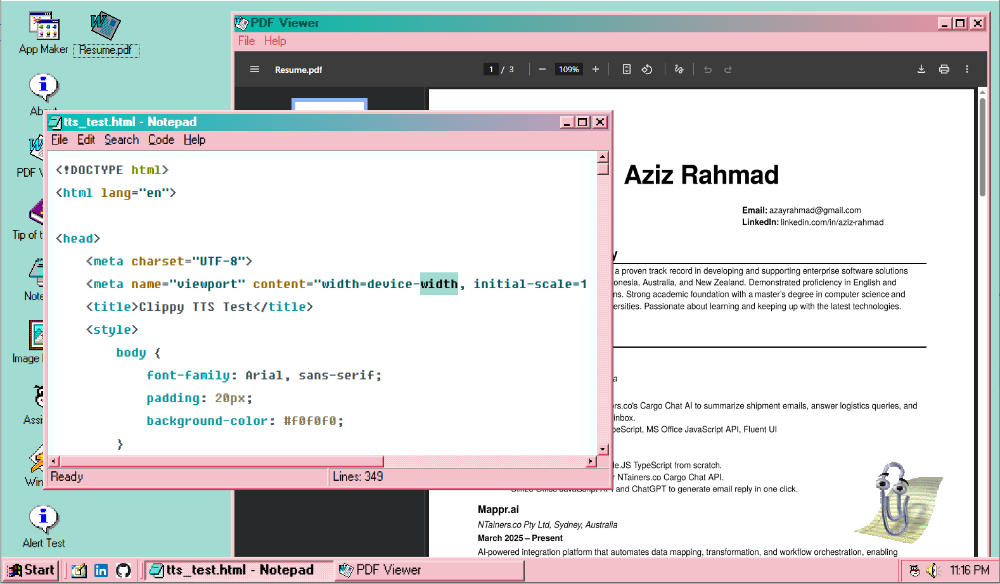
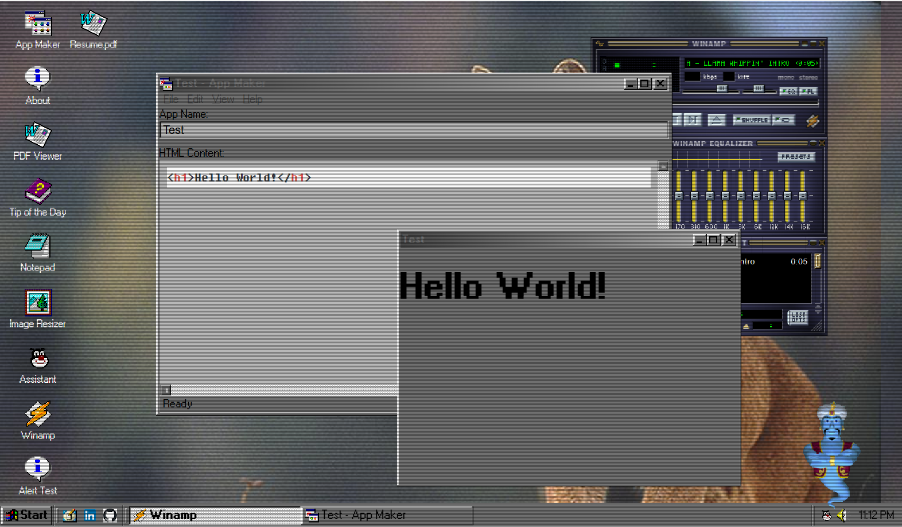
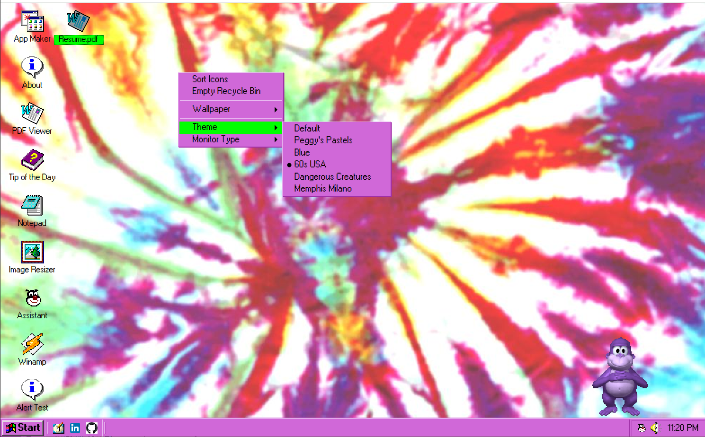

# azOS, Second Edition

azOS, Second Edition is a web-based operating system interface designed to emulate Windows Classic. This project was born out of my love for Windows Classic (9x/NT era) and my interest in LLM.

## Live Demo

Experience azOS Second Edition live: **[azOS Second Edition](https://azayrahmad.github.io/azos-second-edition/)**

## Screenshots

*Default Desktop*


*Desktop with Clippy and Notepad*


*Desktop with Winamp and App Maker*


*Desktop Context Menu with Theme Options*


## Features

- **Classic Desktop Interface**: A retro UI that mimics the look and feel of Windows Classic, complete with a desktop, taskbar, and start menu.
- **Window Management**: Draggable, resizable, and minimizable application windows with a familiar GUI.
- **Application Suite**: Comes with a set of built-in applications, including Notepad, PDF Viewer, and Webamp.
- **AI Integration**: Features an interactive Clippy assistant powered by a large language model.
- **Customizable Environment**: Personalize the desktop with different themes, wallpapers, and cursor styles.
- **File System Support**: Open and save files with modern browser APIs.
- **Developer Tools**: Includes a code editor with syntax highlighting, formatting, and Markdown preview.
- **Progressive Web App**: Install it on your machine as a desktop application.

## Featured Applications

- **Assistant**: An interactive AI assistant that can answer questions about azOS. For more details, see the [Clippy App README](./src/apps/clippy/README.md).
- **Notepad**: A powerful text editor with syntax highlighting, code formatting, and Markdown preview. For more details, see the [Notepad App README](./src/apps/notepad/README.md).
- **Webamp**: A faithful recreation of the classic Winamp music player that runs directly on the desktop. For more details, see the [Webamp App README](./src/apps/webamp/README.md).
- **PDF Viewer**: A simple application for viewing PDF documents. For more details, see the [PDF Viewer App README](./src/apps/pdfviewer/README.md).

For a full list of applications and instructions on how to create your own, refer to the [Application Development Guide](./src/apps/README.md).

## Technologies Used

- **Frontend Framework**: Vanilla JavaScript, HTML, and CSS.
- **Development Server**: [Vite](https://vitejs.dev/) for a fast and modern development experience.
- **UI Libraries**:
  - [98.css](https://jdan.github.io/98.css/): A CSS library for recreating the Windows 98 GUI.
  - [os-gui](https://os-gui.js.org/): A library for building retro desktop GUI components.
    Note that both libraries have been heavily modified to combine their features and fit the needs of this project.
- **AI Assistant**:
  - [Clippy.js](https://github.com/pi0/clippyjs): The frontend library for the Clippy agent. This also has been heavily modified with TTS and Ask functionality.
  - **Resume Chat API**: A custom API for processing natural language questions. This has its own repository at [resume-chat-api](https://github.com/azayrahmad/resume-chat-api). I made this specifically to manage LLM feature for the assistant.
- **External Libraries**:
  - [Webamp](https://webamp.org/): The web-based Winamp player.
  - [highlight.js](https://highlightjs.org/): For syntax highlighting in Notepad.
  - [Prettier](https://prettier.io/): For code formatting.
  - [Marked.js](https://marked.js.org/): For Markdown to HTML conversion.

## Getting Started

To run this project locally, follow these steps:

1.  **Install Dependencies:**
    ```bash
    npm install
    ```

2.  **Run the Development Server:**
    ```bash
    npm run dev
    ```
    The application will be available at `http://localhost:5173` (or another port if 5173 is in use).
