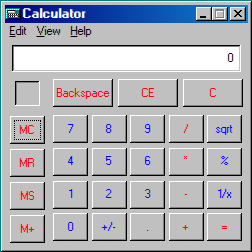

# Calculator

A calculator application that mimics the look and feel of the Windows 98 calculator.

## Purpose

This application provides a fully functional calculator with both "Standard" and "Scientific" modes. It is designed to be a faithful recreation of the original Windows 98 calculator, providing a nostalgic and useful tool for users.

## Key Features

- **Standard Mode**: Perform basic arithmetic operations, including addition, subtraction, multiplication, division, square root, percentage, and reciprocal calculations.
- **Scientific Mode**: Access advanced mathematical functions, such as trigonometric, logarithmic, and exponential functions, as well as number base conversions (hexadecimal, decimal, octal, binary).
- **Memory Functions**: Store, recall, and clear values using the MC, MR, MS, and M+ buttons.
- **Authentic UI**: The user interface is carefully designed to match the classic Windows 98 calculator, including button layout, colors, and fonts.

## How to Use

- Launch the application from the desktop icon or the Start Menu.
- Use the "View" menu to switch between "Standard" and "Scientific" modes.
- Click the buttons with your mouse or use your keyboard to enter numbers and perform calculations.
- The display at the top shows the current input and results.

## Screenshot

