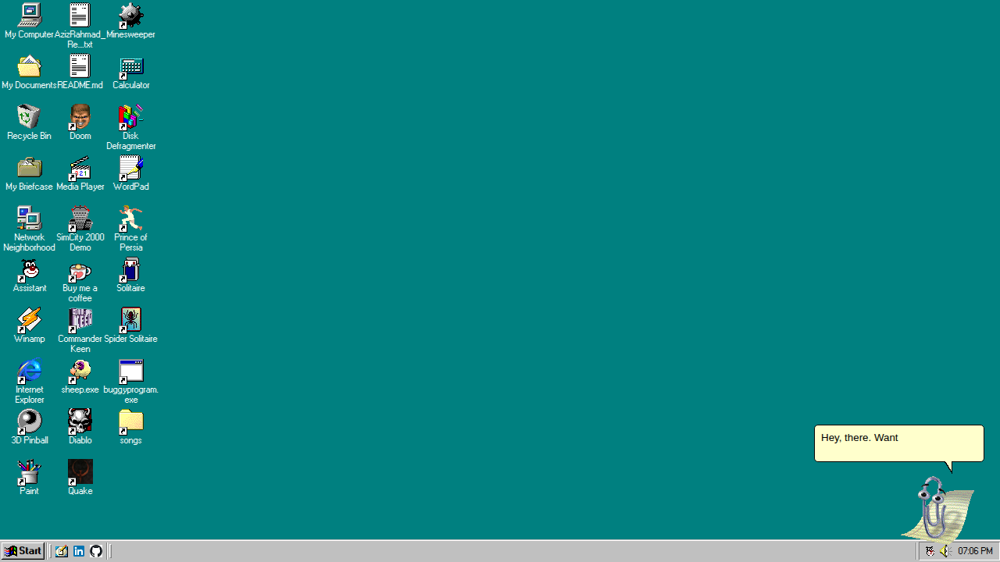

# Assistant 

A recreation of Microsoft Office Assistant in JavaScript. Based on [ClippyJS](https://github.com/clippyjs/clippy.js) by Smore, but enhanced with Text-to-Speech capability and answers powered by Large Language Model (Gemini API). Ask any question about Windows 98, Assistant will help you.

## Purpose

I originally built this as a companion to my portfolio website, the original azOS, before I shifted my focus here. Sort of like an interactive resume where, instead of reading a resume, you ask Assistant about me, my qualifications and work experiences, and it will answer. Now Assistant works here, meaning it will answer anything you ask about Windows 98. You can still ask it about my resume though.

## Key Features

- **Interactive AI Assistant**: A fully animated Assistant character that responds to user questions with spoken answers and expressive animations. Assistant will try to classify your question and match it with its knowledge library and respond based on its finding.
- **Windows 98 Q&A**: Ask any questions about Windows 98 Web Edition, and it will provide an answen. Try asking it about itself for Easter eggs. I have put some safeguards around its instruction, so it won't answer any question outside its assigned job, sorry.
- **Text-to-Speech**: Assistant's responses are read aloud using the browser's built-in voice synthesis. Some older mobile browsers I tested are not compatible with this though, I'm working on it. 
- **Agent Selection**: Users can switch between different agents, such as "Clippy" and "Genius." I intend to implement distinct personality for each agent character, but for now, whichever character you use it will refer to itself as Clippy.
- **Context Menu**: Right-clicking on the agent provides quick access to actions like asking a question, triggering a random animation, or closing the app.

## How to Use

1.  **Launch Clippy**: Double-click the "Assistant" icon on the desktop to make Clippy appear.
2.  **Ask a Question**: Click on Clippy to open the input balloon, type your question, and press Enter.
3.  **Interact**: Right-click on Clippy to open the context menu and explore other options.

## Technologies Used

- **AI and Backend**:
  - **Resume Chat API**: A custom API that processes natural language questions and returns structured responses with answer text and animation cues. The API is hosted in Vercel. The assistant instruction is stored here. What it does is essentially just package your question with the instruction and send it to an LLM provider and sent the answer back to Assistant. Currently the LLM providers used are Gemini API and Groq.
- **Frontend**:
  - **Clippy.js**: The core library for rendering the animated agent. This is heavily modified from the original code to fit my vision.
  - **Web Speech API**: For text-to-speech functionality, this should be available in your browsers already.

## What's Next

- Ability to comment on user interaction when idle.
- Custom user provided LLM Provider for OpenAI-compatible API.
- Distinct personality for each agent character. 
- Improved animation and speech 

## Screenshot

