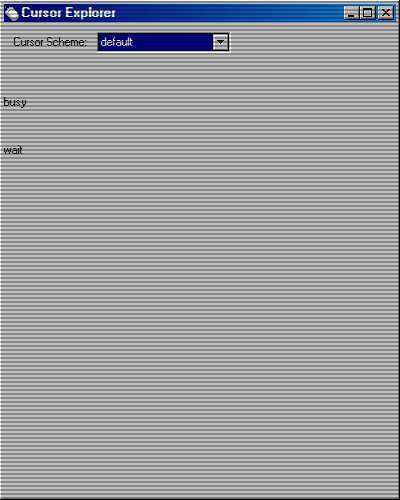

# Cursor Explorer

Just a simple app to show various cursor schemes available in the system. Currently all you can do is browse for the schemes and see the previews of each cursor. To use it you need to go to Desktop Themes and select the associated theme.

## Screenshot

## TODO

- Make animated cursor preview instead of changing the cursor. 
- Ability to apply selected cursor scheme and overriding active theme cursor scheme.
