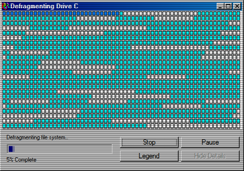

# Disk Defragmenter 

A program I made for fun that simulates old Windows 98 Disk Defragmenter. 
a
Basically every time you open it it will generate a fake fragmented disk and start animating the defragmentation slowly while sound effect of a hard disk drive being defragmented is playing. You can pause and resume the process but if you stop it and close, the next launch would be a completely new randomized fragmented disk. No actual disk defragmentation would happen when you run this program.

When I was little I saw my dad running Defragmenter and I can't help but be mesmerized at the visual of disk being defragmented. This inspired me to create this program.

## Screenshot

## TODO

- Add immobile disk sector types
