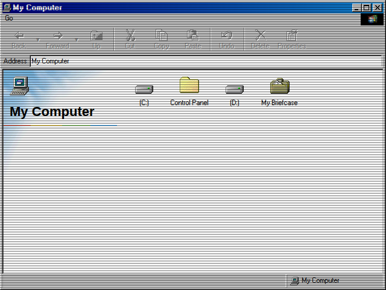

# Explorer

## Purpose

Explorer is a file and folder navigation tool for the azOS environment. It provides a familiar, graphical interface for browsing the virtual file system, including drives, folders, and special system locations. It serves as the primary way for users to access and manage files and applications.

## Key Features

- **Hierarchical Navigation:** Browse through a tree-like directory structure, starting from "My Computer."
- **Special Folders:** Provides access to special system folders, including:
    -   **My Computer:** The root view showing all available drives.
    -   **Recycle Bin:** View and manage deleted items. Users can restore items to the desktop or delete them permanently.
    -   **Network Neighborhood:** Displays a list of simulated network locations.
- **Navigation Controls:** Use the "Go" menu to navigate "Up" to the parent folder, "Back" to the previously viewed folder, or "Forward" to the next folder in the history.
- **Icon View:** Displays folder and file contents as icons.
- **Application Launching:** Double-clicking an application icon within Explorer will launch that application.
- **Context Menus:** Right-clicking on items or the background provides a context-sensitive menu with options like "Open," "Restore," "Delete," etc.

## How to Use

1.  Launch **Explorer** by double-clicking on folder or drive icons on the desktop, such as "My Computer" or "My Documents."
2.  Double-click a drive or folder icon within the Explorer window to navigate into it.
3.  Use the `Go > Up` menu item to move to the parent directory.
4.  Use `Go > Back` and `Go > Forward` to navigate through your browsing history.
5.  To manage items in the **Recycle Bin**:
    -   Navigate to the Recycle Bin by opening it from the desktop.
    -   Right-click an item to **Restore** it to the desktop or to **Delete** it permanently.

## Screenshot

