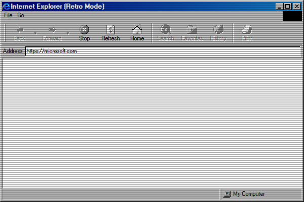

# Internet Explorer

## Purpose

Internet Explorer is a web browser for the azOS environment that allows users to navigate the World Wide Web. A standout feature is its "Retro Mode," which uses the Internet Archive's Wayback Machine to render websites as they appeared in the year 1998, providing a nostalgic browsing experience.

## Key Features

- **Web Browsing:** A fully functional browser that can load and display modern websites.
- **Address Bar:** Enter a URL in the address bar and press Enter to navigate to a site.
- **Retro Mode:** When enabled, the browser will automatically load the 1998-archived version of any requested website via the Wayback Machine. This mode can be toggled from the `File > Retro Mode` menu.
- **Navigation Controls:** The `Go` menu provides standard browser navigation:
    -   **Back:** Go to the previous page in the session history.
    -   **Forward:** Go to the next page in the session history.
    -   **Up:** Navigate up one level in the URL path (e.g., from `example.com/folder/page` to `example.com/folder`).
- **Status Bar:** Displays the current loading status of a webpage (e.g., "Connecting to site...", "Done," "Page not found.").

## How to Use

1.  Launch **Internet Explorer**.
2.  Type a web address (e.g., `google.com`) into the address bar at the top of the window and press **Enter**.
3.  The page will load in the main content area. By default, it will attempt to load the 1998 version.
4.  To view the modern version of a website, go to the `File` menu and uncheck **Retro Mode**. Then, navigate to the site again.
5.  Use the `Go` menu to navigate back and forward through your browsing history or to go up one level in the current URL's directory structure.

## Screenshot

