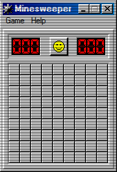

# Minesweeper

This is a classic implementation of the Minesweeper game, made as faithful as possible to the original Windows 98 version.

## Credits

- The main logic is adapted from [AlexAegis/minesweeper](https://github.com/AlexAegis/minesweeper).
- Number sprites are from [1j01/98](https://github.com/1j01/98).
- Tile sprites and icons are from [The Cutting Room Floor](https://tcrf.net/Minesweeper_(Windows,_1990)).

## Screenshot

