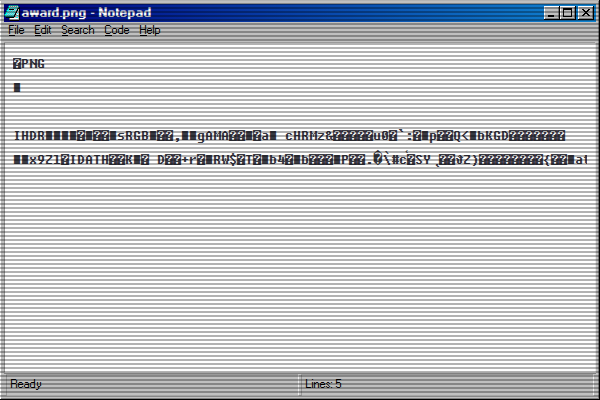

# Notepad App

## Purpose

Notepad is a versatile text editor for azOS Second Edition, with features like syntax highlighting, code formatting, and Markdown preview. I don't think at this point it still should be called Notepad though, perhaps Code Editor.

I made this mainly to help with my job. I often need to put code snippets for my teaching material, and this notepad can format my code and copy it along with syntax highlight to paste in my PowerPoint or Word documents. Give it a try!

## Key Features

- **Advanced Text Editing**: A core text area for input, synchronized with a live-rendering pane for a what-you-see-is-what-you-get experience.
- **File System Integration**: Full support for file operations:
  - **New, Open, Save, and Save As**: Create, open, and save files with a modern interface that uses the File System Access API where available.
  - **Unsaved Changes Protection**: Automatically detects and prompts to save unsaved changes before closing a file.
- **Developer Tools**:
  - **Syntax Highlighting**: Automatically applies syntax highlighting for various languages based on file extension.
  - **Code Formatting**: Integrates the Prettier code formatter to beautify code with a single click.
  - **Markdown Preview**: Instantly preview Markdown files as rendered HTML in a separate window.
- **User-Friendly Interface**:
  - **Dynamic Window Title**: The window title updates to show the current file name and an asterisk (`*`) to indicate unsaved changes.
  - **Status Bar**: Provides at-a-glance information, including the current editor status and total line count.
  - **Copy with Formatting**: Allows users to copy text with its syntax highlighting as rich HTML.

## How to Use

1.  **Launch Notepad**: Open the app from the desktop or start menu.
2.  **Create or Open a File**: Use the "File" menu to create a new document or open an existing one from your local system.
3.  **Edit and Format**: Write and edit text in the main editor. Use the "Format" menu to apply code formatting or the "View" menu to preview Markdown.
4.  **Save Your Work**: Use the "File" > "Save" or "Save As" options to save your document.

## Technologies Used

- **Frontend Libraries**:
  - **highlight.js**: For syntax highlighting.
  - **Prettier**: For code formatting.
  - **Marked.js**: For Markdown to HTML conversion.
- **UI Components**:
  - **os-gui**: The UI component library for the main application window.

## What's next 

- Improve performance: Currently it's quite slow when loading a large document. Not sure how other online editors do it, but I wish I can improve this too.

## Screenshot

