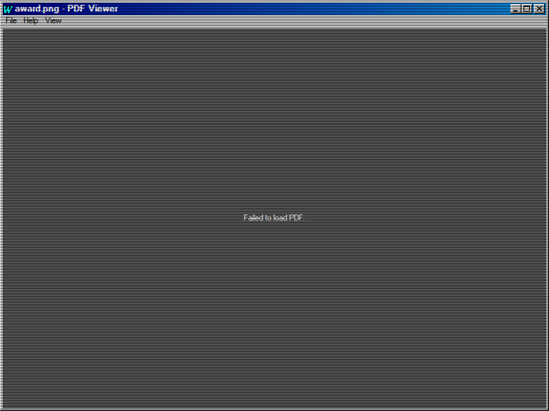

# PDF Viewer App

## Purpose

The PDF Viewer is a simple and efficient application for viewing PDF documents within azOS Second Edition. It leverages the browser's native PDF rendering capabilities to display documents directly inside an application window.

## Key Features

- **Native PDF Rendering**: Opens and displays `.pdf` files using the browser's built-in PDF viewer for a seamless experience.
- **File Association**: Associated with `.pdf` files, allowing users to open them by double-clicking them on the desktop or in a file explorer.
- **Dynamic Window Title**: The window title updates to show the name of the currently opened PDF file (e.g., "PDF Viewer - MyDocument.pdf").
- **Download Fallback**: If the browser is unable to render the PDF, it provides a convenient link to download the file instead.

## How to Use

1.  **Open a PDF File**: Double-click any `.pdf` file on the desktop.
2.  **View the Document**: The PDF Viewer will automatically launch and display the contents of the file.
3.  **Launch without a File**: If opened directly, the app will display a message prompting you to open a PDF file.

## Technologies Used

- **Web Platform APIs**:
  - **HTML `<object>` tag**: The core technology used to embed and render the PDF document within the application window.

## Screenshot

