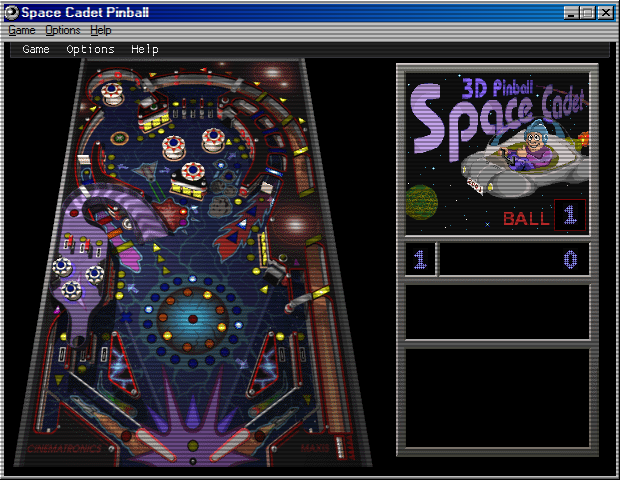

# 3D Pinball

## Purpose

3D Pinball brings the classic "Space Cadet" pinball table, famously included with Windows, to the azOS desktop. This application is a web-based port of the original game, offering the full, nostalgic experience with all the original sounds and physics.

## Key Features

- **Classic Gameplay:** A faithful recreation of the "Space Cadet" pinball table.
- **Game Controls:** The `Game` menu provides options to start a new game, launch the ball, and pause or resume gameplay.
- **Keyboard Mappings:** The application provides a clear list of keyboard controls for all game actions.
- **Full Screen Mode:** The game can be played in full screen for a more immersive experience.

## How to Use

1.  Launch the **3D Pinball** application.
2.  Use the `Game` menu or press **F2** to start a **New Game**.
3.  Press and hold the **Spacebar** to pull back the plunger, then release it to **Launch Ball**.
4.  Use the keyboard controls to play the game. To see the controls, go to `Options > Player Keys...`.
    -   **Left Flipper:** `Z`
    -   **Right Flipper:** `/` (Slash)
    -   **Left Table Bump:** `X`
    -   **Right Table Bump:** `.` (Period)
5.  Press **F3** to **Pause** or **Resume** the game at any time.
6.  To play in full screen, select `Options > Full Screen`.

## Screenshot

