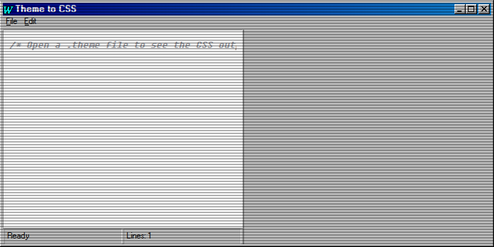

# Theme to CSS App

## Purpose

A developer utility to convert `.theme` INI files into CSS.

## Key Features

-   Loads `.theme` files via a menu bar.
-   Parses the file format.
-   Generates CSS custom properties.
-   Displays the output with syntax highlighting.
-   Allows saving the generated CSS to a file.

## How to Use

1.  Launch the "Theme to CSS" application.
2.  Go to `File > Open` in the menu bar and select a `.theme` file.
3.  The converted CSS will appear in the editor.
4.  To save the output, go to `File > Save` and choose a location for the `.css` file.

## Screenshot

