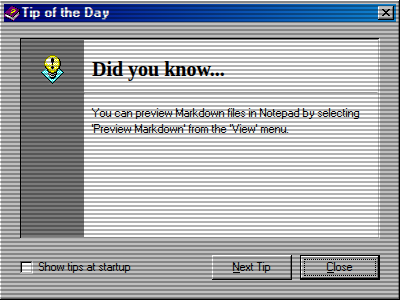

# Tip of the Day App

## Purpose

The "Tip of the Day" app is a helpful utility that displays useful hints and tricks to the user upon startup. Its purpose is to improve user experience by providing quick insights into the features and functionalities of azOS Second Edition.

## Key Features

- **Randomized Tips**: Displays a random tip each time it is launched, ensuring users see a variety of information.
- **Tip Navigation**: A "Next Tip" button allows users to cycle through the entire list of available tips.
- **Interactive Links**: Tips can contain embedded links that, when clicked, can launch other applications.
- **Startup Preference**: Includes a "Show tips at startup" checkbox, allowing users to control whether the dialog appears automatically when the system starts.
- **Classic UI**: The app is presented in a classic dialog window with a distinct icon and layout.

## How to Use

1.  **Automatic Launch**: By default, the "Tip of the Day" window appears automatically when azOS starts.
2.  **Navigate Tips**: Click the "Next Tip" button to see another tip.
3.  **Disable at Startup**: Uncheck the "Show tips at startup" box to prevent the window from appearing automatically in the future.

## Technologies Used

- **UI Components**:
  - **HTML/CSS**: The app's layout and styling are defined in a dedicated HTML snippet.
  - **os-gui**: The UI component library for the main application window.
- **App Integration**:
  - **`handleAppAction`**: A utility function used to launch other applications from within a tip.

## Screenshot

